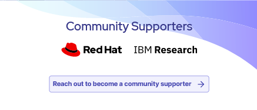

# Konveyor Community Site

This is the repository for [www.konveyor.io](https://www.konveyor.io/). The site was built using [Gatsby](https://www.gatsbyjs.com/), a React-based framework. The styling was done using [Tailwind CSS](https://tailwindcss.com/), a utility-first CSS framework.

## Contributing

### Prerequisites

Your system needs to have the following installed to be able to build this website:

- [Node.js](https://nodejs.org/) (version 16, it won't work with version 18 yet)

- [git](https://git-scm.com/)
- [yarn](https://www.npmjs.com/package/yarn)
- [gatsby-cli](https://www.npmjs.com/package/gatsby-cli)

### Cloning the repository

1. [Fork this repository](https://github.com/konveyor/website/fork) into your own GitHub account.
1. Clone the site to your local machine:  
   `git clone git@github.com:your-username/website.git`.
1. Add the upstream remote to follow this repository's changes:  
   `git remote add upstream git@github.com:konveyor/website.git`  
   `git fetch upstream`

### Building the site locally

1. Run `yarn` to install all of the required packages.
1. Run `yarn run dev` to build and run a development server.

If the site builds successfully, you can access it at [http://localhost:8000](http://localhost:8000).

To clear cache files, run `gatsby clean`. This is sometimes needed to ensure a clean build.

### Submitting a pull request

After your changes are done and tested, you are ready to submit a Pull Request.

First, create a local branch on your local machine:

```
git checkout -b my-feature-branch
```

Then, add, commit, and push your changes:

```
git add files-that-you-modified
git commit -m "short message describing changes"
git push origin my-feature-branch
```

Finally, [submit a Pull Request](https://github.com/konveyor/website/compare)

## Content types

### Blog posts

Blog posts can be found under `src/content/blog`. To create a new post:

1. Create a new directory. The name of the directory will be the base of the URL. Use lowercase letters and hyphens only — no upppercase or other punctuation allowed.

1. In that directory create a file called `index.mdx`. The file have a frontmatter section containing various fields and the [markdown](https://mdx.jp/docs/cheatsheet/) section containing the actual blog post.

1. Fill out the frontmatter fields. Example frontmatter:

```
---
author: tquinn
date: 2021-03-03T07:00:00Z
description: >-
  When we started providing professional services around enterprise Kubernetes, it became clear we needed a program-level framework for adopting containers that spelled out the activities of multiple project teams.
featured: true
image: banner.jpg
tags:
  - Metrics
  - OpenShift
title: Exploring a Metrics-Driven Approach to Transformation
---
```

The fields are:

- **author** — the author identifier. _Note: author field not currently used._
- **date** — The publication date of the post. Must follow the above format.
- **description** — The description will be used when the post is shared to social media.
- **featured** — Should this post be displayed under Featured Posts? Use sparingly. It makes no sense to have every post be a featured post.
- **image** — This is the main image of the post and the image that will be used on social media shares. Place image in the post directory.
- **tags** — One tag per line, titlecase. Less is more with tags. These are only used to link to related posts. They are _not_ SEO keywords. Do not attempt to come up with as many tags as you can think of and all of their synonyms. No, seriously, don't do it.
- **title** — Title of the post.

### Hello Bar

This is an optional call-to-action displayed at the top of each page. It is configured in `src/content/hello-bar/hello-bar.yml`.

Example file:

```
display: true
title: State of Application Modernization Report 2022 is out!
end_date: 2023-01-01T8:00:00-08:00
background_color: base
link_text: Read the report
link_url: /modernization-report/
```

Displays as:


The fields are:

- **display** — Boolean controlling the display of the Hello Bar.
- **title** — Title text to display.
- **end_date** — The expiration date of the Hello Bar.
- **background_color** — The theme color for the background. Valid values are `base`, `primary`, and `accent`.
- **link_text** — the button text.
- **link_url** — the URL to link to.

### Community supporters

The supporters are displayed on the home page. These are configured by `src/content/members/members.yml`.

Example file:

```
- name: Red Hat
  logo: red-hat-logo.svg
- name: IBM Research
  logo: ibm-research.svg
```

The fields are:

- **name** — used as the accessibility text for the logo.
- **logo** — the logo file name. Files are in the same directory. Note: this should be in SVG format for the best results.

To support light and dark mode, use `currentColor` in the SVG for the main color. This will display as black in light mode:



and as white in dark mode:


## Code of Conduct
Refer to Konveyor's [Code of Conduct](https://github.com/konveyor/community/blob/main/CODE_OF_CONDUCT.md).
