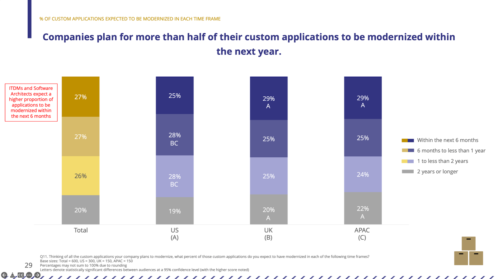
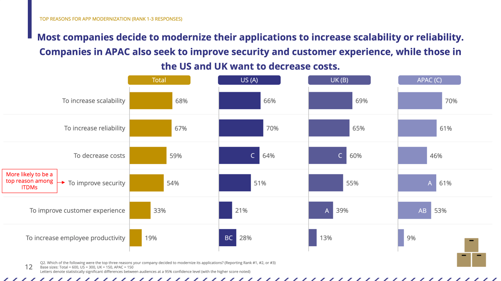
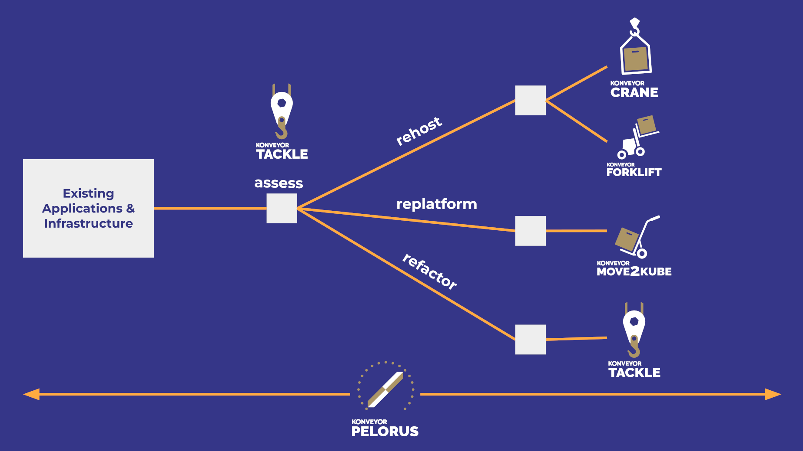

Konveyor is a community of people passionate about helping others modernize and migrate their applications to the hybrid cloud by building tools, identifying patterns, and providing advice on how to break down monoliths, adopt containers, and embrace Kubernetes. To do so we’re currently working on five projects to help users rehost, replatform, and refactor their applications to Kubernetes.

While conversations with users and data from various sources gave us some visibility into how migrations were taking place, we wanted to inform our priorities with recent detailed data. To do so, Konveyor community contributor Red Hat sponsored a survey of 600 IT decision makers, backend developers, and software architects in the US, UK, and English-speaking Asia-Pacific (APAC) to better understand the application modernization landscape and approaches.

Here are some of the findings that relate to Konveyor. You can find more detail in the [full report](/modernization-report/).

## Application modernization is happening now

One finding is that there is some urgency to rolling out migration tooling because the train is leaving the station quickly. We only surveyed people who were migrating or planning to migrate but, among that group, this isn’t a plan for a sometime future. It’s happening now. They plan to modernize over half of their custom applications during the next year and over a quarter during the next six months. Only 20% expected the modernization to take more than two years.

That said, it’s not all smooth sailing. Regions that aren’t as far along on their application modernization journeys haven’t encountered serious barriers yet. However, those that have progressed further — notably the US — report that choosing among the approaches open to them isn’t straightforward. And, as we’ll see, they have a lot of options to choose from.

## Motivators for modernizing existing applications to Kubernetes

The survey tells us the migrations are mostly being driven by reliability and scalability, with security high up as well. Decreasing costs were also on the list but, as we frequently see in other surveys about technology adoption or change, it’s not the driving factor.

## How well do their migration plans line up with the capabilities that Konveyor projects provide?

Quite well. But before going into the details, let’s consider the “six Rs,” a common way to talk about app migration options.

Three of the Rs aren’t really relevant to a Konveyor discussion because they don’t involve moving an existing application: Retire (decommission), Retain (leave as-is for now), and Repurchase (move to a SaaS model). Together these accounted for only about 39% of the migration total with about half that total accounted for by repurchasing.

Four of the Konveyor projects closely relate to one of the remaining types of application migration discussed below. A fifth — _Pelorus_ — is focused on measuring the key metrics to software delivery performance because being able to measure the impact of rehosting, replatform, refactoring, and changing processes and culture is vital to proving value.

### Rehost

Rehosting (20% of total) involves copying applications to a cloud (whether hosted or on-prem) with minimal changes, i.e. “lift and shift.” This will be familiar to anyone who was involved in virtualization early on when bare metal servers were often moved to a virtual machine for greater efficiency but with little or no changes to the software and with relatively modest operational changes. While rehosting doesn’t provide the same depth of benefits as replatforming or refactoring, it’s the first step in the right direction. Rehosting was the single most common approach.

_Forklift_ and _Crane_ are the relevant Konveyor projects here. Forklift is focused on migrating virtual machines to Kubernetes and provides the ability to migrate multiple virtual machines to KubeVirt with minimal downtime. Crane is another rehosting tool that meets a different use case. It allows organizations to migrate applications between Kubernetes clusters. There are many times when developers and operations teams want to migrate between older and newer versions of Kubernetes, evacuate a cluster, or migrate to different underlying infrastructure.

### Replatforming

Replatforming (18% of total) is using a cloud migration to upgrade operating systems, databases, and other components as needed in order to cloud-enable applications without changing core application code or architecture. Think of it as “lift, tinker, and shift.” This is effectively an intermediate step between just rehosting and refactoring. In fact, it’s often a stepping stone; the survey found that 90% of those planning to refactor their apps plan to replatform them first.

_Move2Kube_ is a Konveyor project that allows customers to replatform their applications to Kubernetes orchestrated platforms. One area where replatforming is taking place is in the consolidation of container orchestration platforms to Kubernetes. Due to this consolidation, the Move2Kube project was started to focus on accelerating the process of replatform to Kubernetes from platforms such as Swarm and Cloud Foundry. The project translates existing artifacts to Kubernetes artifacts to speed up the process of being able to run applications on Kubernetes.

### Refactoring

Refactoring (17%) is often viewed as the most challenging app modernization strategy but the one with the most long-term impact. It involves re-architecting as cloud-native, for example, by containerizing workloads, transforming a monolith to microservices, or moving functions to a serverless architecture.

While _Tackle_ is not a full refactoring tool, it provides a series of interrelated tools that allow users to assess, analyze, and ultimately move their applications onto a Kubernetes orchestrated platform.

As you can see, organizations are taking a thoughtful approach to app migration and there’s no single right path. This data supports the Konveyor community’s approach of providing a toolbox, rather than just a singular tool, that can support transitioning applications however it is happening.
