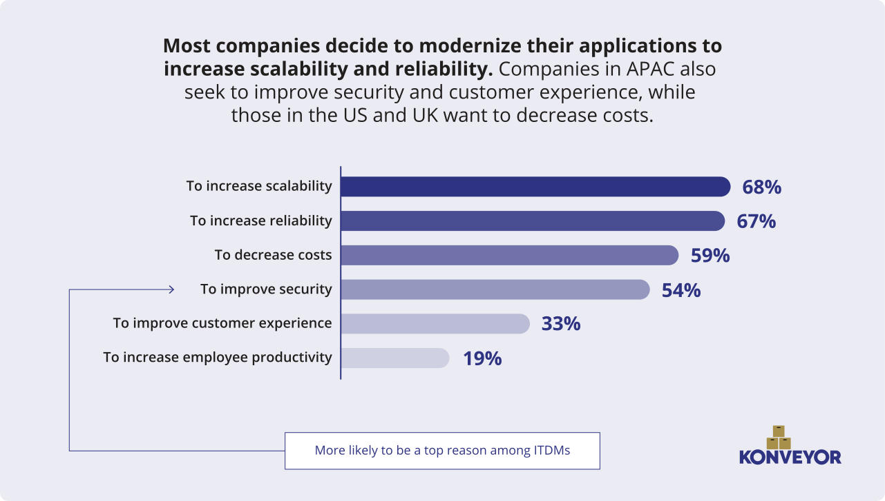

Konveyor is a community of people passionate about helping others modernize and migrate their applications to the hybrid cloud by building tools, identifying patterns, and providing advice on how to break down monoliths, adopt containers, and embrace Kubernetes. To do so the Konveyor community is currently working on five projects to help users rehost, replatform, and refactor their applications to Kubernetes.

While conversations with users and data from various sources gave us some visibility into how migrations were taking place, we wanted to inform our priorities with recent detailed data. To do so, Red Hat, a Konveyor community contributor, sponsored a survey of 600 IT decision makers, backend developers, and software architects in the US, UK, and English-speaking Asia-Pacific (APAC) to better understand the application modernization landscape.

Here are some of the findings that relate to Konveyor and application modernization:

## Application modernization is happening now

It’s clear that there is urgency to roll out migration tooling. Among those we surveyed, those who were migrating or planning to, we found that they plan to modernize over half of their custom applications during the next year and over a quarter during the next six months. Only 20% expected the modernization to take more than two years. It’s clear this is happening right now.

That said, it’s not all smooth sailing and this doesn’t happen overnight. While some regions haven’t progressed far enough in their application modernization journey to experience serious barriers, others (notably the US) report that choosing a straightforward approach can be challenging. Organizations have many options to choose from and each option presents varying levels of complexity.

## Motivators for modernizing existing applications to Kubernetes

The survey tells us modernization is mostly being driven by the need for reliability, scalability and security. Decreasing costs were also on the list but, as we frequently see in other surveys about technology adoption or change, it’s not the driving factor.

Konveyor's tool suite can be used to help realize organization’s migration plans.

The Konveyor tool suite maps closely to the migration strategies companies intend to use based on this survey: rehosting, replatforming, and refactoring.

## Rehost applications to cloud with Forklift and Crane

Rehosting (20% of total) involves copying applications to a cloud (whether hosted or on-prem) with minimal changes, i.e. “lift and shift.” This will be familiar to anyone with experience in virtualization early on when bare metal servers were often moved to a virtual machine (VM) for greater efficiency but with little or no changes to the software and with relatively modest operational changes.

While rehosting doesn’t provide the same depth of benefits as replatforming or refactoring, it’s the first step in the right direction. Rehosting was the single most common approach
**Forklift** and **Crane** are the relevant Konveyor projects here. Forklift is focused on migrating VMs to Kubernetes and provides the ability to migrate multiple VMs to KubeVirt with minimal downtime.

Crane is a rehosting tool that meets a different use case. Crane helps organizations to migrate applications between Kubernetes clusters. There are many times when developers and operations teams want to migrate between older and newer versions of Kubernetes, evacuate a cluster, or migrate to different underlying infrastructure.

## Replatforming applications with Move2Kube

Replatforming (18% of total) is using a cloud migration to upgrade operating systems, databases, and other components as needed in order to cloud-enable applications without changing core application code or architecture. Think of it as “lift, tinker, and shift.”

This is effectively an intermediate step between just rehosting and refactoring. In fact, it’s often a stepping stone; the survey found that 90% of those planning to refactor their apps plan to replatform them first.

**Move2Kube** is a Konveyor project that allows customers to replatform their applications to Kubernetes orchestrated platforms. One area where replatforming is taking place is in the consolidation of container orchestration platforms to Kubernetes.

Due to this consolidation, the Move2Kube project was started to focus on accelerating the process of replatforming to Kubernetes from platforms such as Swarm and Cloud Foundry. This project translates existing artifacts to Kubernetes artifacts to speed up the process of being able to run applications on Kubernetes.

## Refactoring applications with Tackle

Refactoring (17%) is often viewed as the most challenging application modernization strategy but it's the one with the most long-term impact. Refactoring involves re-architecting as cloud-native, for example, by containerizing workloads, transforming a monolith to microservices, or moving functions to a serverless architecture.

While **Tackle** is not a full refactoring tool, it provides a series of interrelated tools that allow users to assess, analyze, and ultimately move their applications onto a Kubernetes orchestrated platform.

---

As you can see, organizations are taking a thoughtful approach to app migration and there’s no single right path. This data supports the Konveyor community’s approach of providing a toolbox, rather than just a singular tool, that can support transitioning applications however it is happening.
