**Author**: [John Matthews](https://github.com/jwmatthews)

### Overview

Konveyor AI or "Kai", is an early effort of Generative AI applied to Application Modernization being explored under the Konveyor Ecosystem at [konveyor-ecosystem/kai](https://github.com/konveyor-ecosystem/kai).

Kai implements a [Retrieval Augmented Generation (RAG)](https://www.promptingguide.ai/techniques/rag) approach that leverages data from Konveyor to help generate code suggestions to aid migrating legacy code bases to a different technology. The intent of this RAG approach is to shape the code suggestions to be similar to how an organization has solved problems in the past, without additional fine-tuning of the model.

#### Demonstration Video

The team has explored a use case of a Java EE application migrating to Quarkus for it's first example. Kai can be applied to other domains beyond Java EE -> Quarkus, the only requirement is that [analyzer-lsp](https://github.com/konveyor/analyzer-lsp) supports the language and there are sufficient [rulesets](https://github.com/konveyor/rulesets/tree/main/default/generated) defined for the target.


#### Below is a high level view of where Kai fits into a typical large scale modernization engagement.

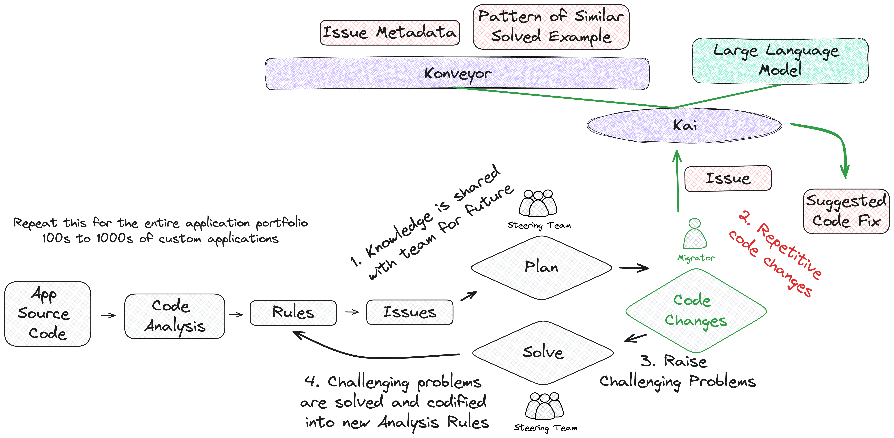

### What does Kai provide?

Konveyor extended with Kai allows developers to work in their IDE to see analysis information and request code suggestions to resolve those migration issues.

Kai's basic workflow from an IDE is:

1. Discover migrations issues via static code analysis
2. Generate a fix for migration issues

#### Access static code analysis information from Konveyor's [analzyer-lsp](https://github.com/konveyor/analyzer-lsp) inside the IDE

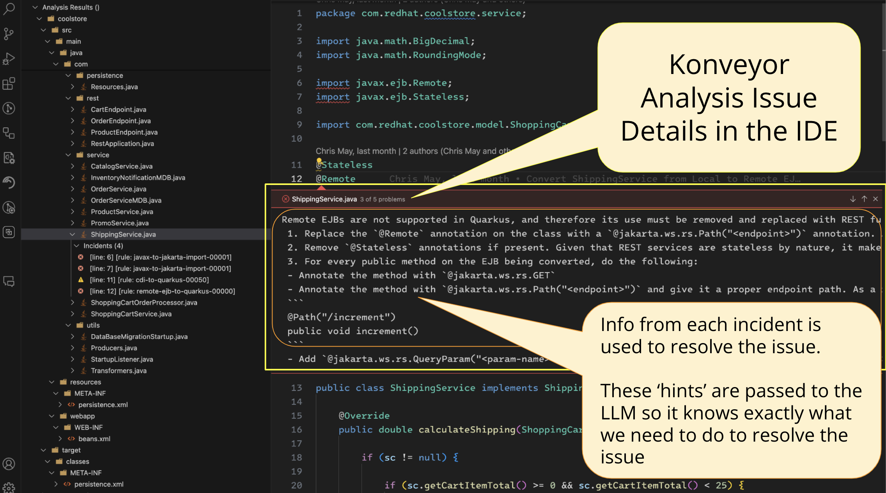

#### For a given issue, ask Kai to generate a code suggestion to solve the migration issue

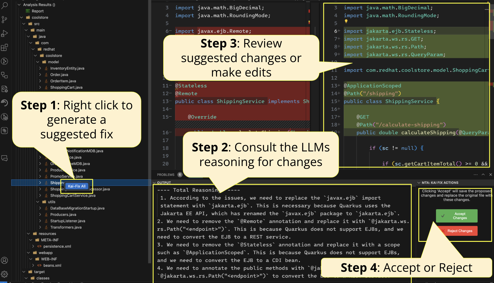

### How does Kai work?


Kai's basic workflow is:

1. Identify migration 'issues' via static code analysis
2. Look to see how the organization has solved similar problems in past, we call this a 'Solved Example'
3. Extract enough contextual info from a 'Solved Example' that we can provide the LLM with guidance of how we want this current problem solved
4. Work with a LLM to generate a code suggestion, giving it both the Analysis Information and any extra contextual info from how the organization has solved this problem in the past
5. Surface the code suggestion either via an API call or in a developers IDE

### RAG Approach

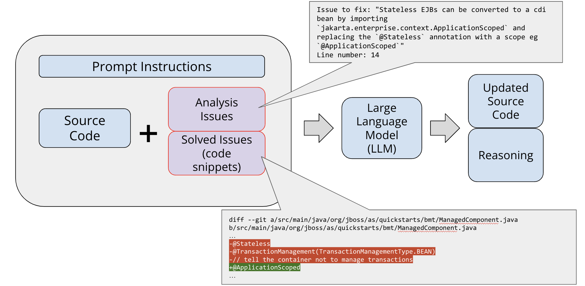
Kai uses 2 types of information to help inform the LLM of additional context to improve a response.

1. Static Code Analysis Information
2. Solved Examples

#### Static Code Analysis Information

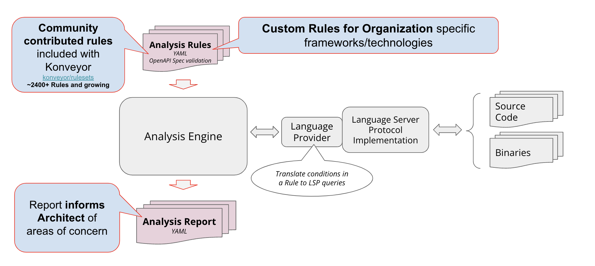

Analysis information is the result of running [analyzer-lsp](https://github.com/konveyor/analyzer-lsp) with a set of rules that help discover points of interest when migrating an application to a new technology. These rules may leverage the ~2400+ community contributed rules at [konveyor/rulesets](https://github.com/konveyor/rulesets/tree/main/default/generated) or may be organization specific custom rules covering information on proprietary corporate frameworks.

We use the analysis information for:

- Identifying what areas of code need to be updated to move to a new technology
- Guidance to inform a developer what the issue is and hints of how they may resolve the problem

For example we can look at the below snippet to see an [example of the YAML data](https://github.com/jwmatthews/sample_kantra_reports/blob/main/coolstore-quarkus/out/output.yaml) from a specific analysis issue informing the developer about a concern when moving from JMS to Quarkus' reactive messaging:

````yaml
incidents:
  - uri: file:///src/main/....../service/InventoryNotificationMDB.java
    message: "JMS `Topic`s should be replaced with Micrometer `Emitter`s feeding a Channel. See the following example of migrating\n a Topic to an Emitter:\n \n Before:\n ```\n @Resource(lookup = \"java:/topic/HELLOWORLDMDBTopic\")\n private Topic topic;\n ```\n \n After:\n ```\n @Inject\n @Channel(\"HELLOWORLDMDBTopic\")\n Emitter<String> topicEmitter;\n ```"
    lineNumber: 60
````

Additionally, this analysis information is available in a more human friendly [WebUI view](https://jwmatthews.github.io/sample_kantra_reports/coolstore-quarkus/out/static-report/#/applications)
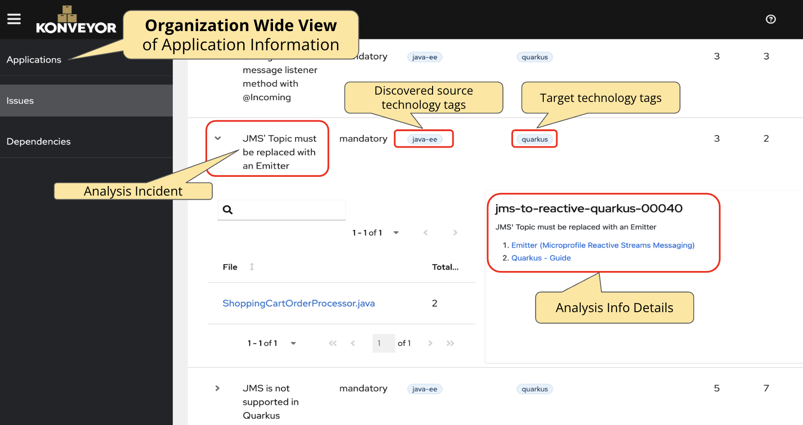

#### Solved Examples

##### What do we mean by 'Solved Examples'

Application Modernization engagements inside a large organization typically encompass ~100s of applications that need to be migrated to a new technology. Often these applications share a large number of similar issues. As an organization successfully migrates a handful of applications they begin to encounter repeated patterns of issues they have already solved. One of the big goals with Kai is helping an organization tap into these prior solutions and leverage them for new migration needs, hence what we refer to as a 'Solved Example'.

##### How do we determine if we have a 'Solved Example' for a given Analysis Incident

Kai will help address similar migration problems by using the data inside of Konveyor which has an organization wide view of the entire application portfolio.


Kai is able to find occurrences of when an application previously had the same problem and then was successfully migrated.

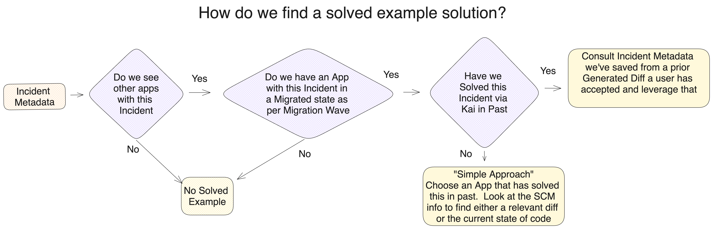

##### Use of 'Solved Examples' in a Few Shot Prompt

Once Kai has found how a similar problem has been solved elsewhere in the organization it extracts part of that information and gives it to the LLM to help consider as a ['few shot'](https://www.promptingguide.ai/techniques/fewshot) example.

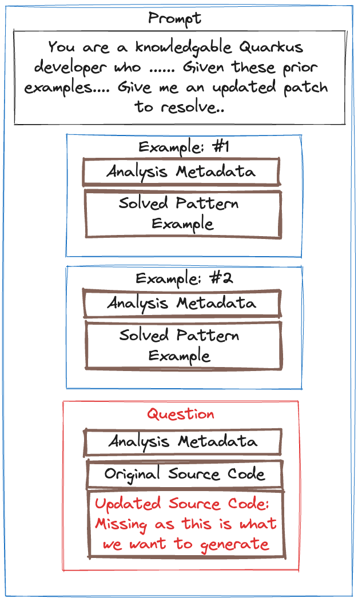

### LLM Specific Concerns

As the team began working with LLMs we identified a few concerns that influenced our approach with Kai.

1. Limited Context Size in LLMs
2. Need to handle changes that cascade throughout a repository
3. Desire to work with knowledge not in the model (an organization's custom frameworks)
4. Model capabilities are quickly improving
5. Iterate on responses with a LLM to improve the solution

#### #1 Limited Context Size in LLMs

LLMs have a limitation on the size of data they will consider when forming a response, this is called their context size. This limitation makes it impractical to ingest an entire source code repository into each request for most models. Kai approaches this limitation by leveraging Konveyor's static code analysis to discover migration issues and use those identified migration issues as the natural boundaries for scoping the problem to smaller subsets.
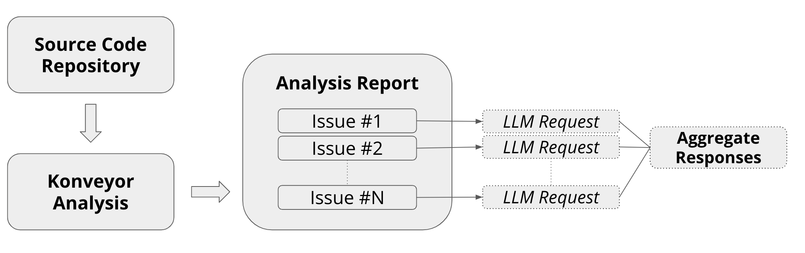

#### #2 How to handle changes that cascade throughout a repository

The first iteration of Kai is focused on splitting work into impacted files as identified from source code analysis. These impacted files are then run through Kai and an updated file is produced. We quickly identified that this approach was lacking the ability to understand changes that will ripple or cascade throughout a repository, such as changing the signature of a method and needing to update each place it is called in external files.

This area of handling cascaded changes is what we refer to as 'Phase 2' and is the next set of development efforts the team is undertaking. Phase 2, inspired by the work of Microsoft in their [CodePlan: Repository-level Coding using LLMs and Planning](https://arxiv.org/abs/2309.12499) paper involves cascading changes throughout a repository of code. We can detect what the changed code "touches" by leveraging the LSP server (similar to what we already use in [analyzer-lsp](https://github.com/konveyor/analyzer-lsp)). Each of those changes is then fed back into the algorithm, over and over, until no more changes are necessary.

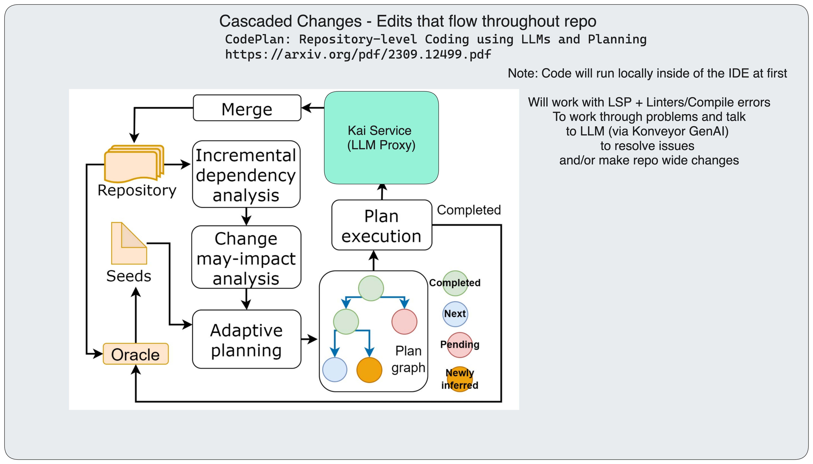

#### #3 Desire to work with knowledge not in the model

The nature of modernization engagements in organizations is that a large number of the issues faced deal with internal propietary frameworks. It is unlikely that an existing model will have data on these frameworks. We are leveraging the RAG pattern described previously to help mitigate this concern by supplying few-shot prompt examples with extra contextual information of how the organization has solved this problem in the past.

Going beyond this RAG pattern we see future work paths to ease the integration of exposing Konveyor's data into on-premise AI platforms such as [Open Data Hub](https://opendatahub.io/). This integration would support an organization's ability for fine tuning a local model on the data they have collected in Konveyor.

#### #4 Model capabilities are quickly improving

We've built Kai to be model agnostic so organizations may experiment with new models as they are released.

Kai may be configured with coordinates to a LLM provider, allowing for use with public AI providers, internally hosted LLMs, or even local LLMs. We introduced a concept of being able to tweak generated prompts based on the 'family' of LLM being used to help facilitate freedom with exploring various models.

#### #5 Iterate on responses with a LLM to improve the solution

We are building the notion of an Agent into Kai to help improve the quality of a LLM's final solution by working with the LLM to iterate on a smaller scoped solution and then running that solution through several tools to help check the validity and go back to the LLM to address problems found.

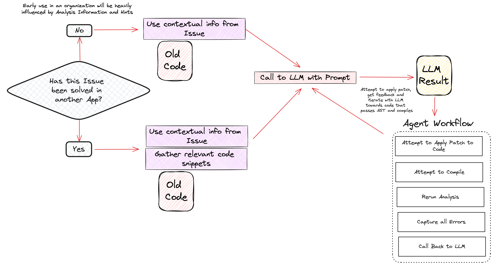

## Next Steps?

The team is working towards integration with Konveyor in Summer 2024, yet plans to remain in the [konveyor-ecosystem](https://github.com/konveyor-ecosystem) for a few more months as the solution is implemented and improved, we expect to pursue being an official Konveyor component later in 2024.

Repositories:

- https://github.com/konveyor-ecosystem/kai
- https://github.com/konveyor-ecosystem/kai-vscode-plugin

For any questions you can reach us via:

- GitHub Issues - https://github.com/konveyor-ecosystem/kai/issues
- Email: [konveyor-dev@googlegroups.com](https://groups.google.com/g/konveyor-dev) mailing list
- Chat: [kubernetes.slack.com #konveyor](https://kubernetes.slack.com/archives/CR85S82A2)
  - [For slack invites - Join Kubernetes on Slack](https://communityinviter.com/apps/kubernetes/community)
