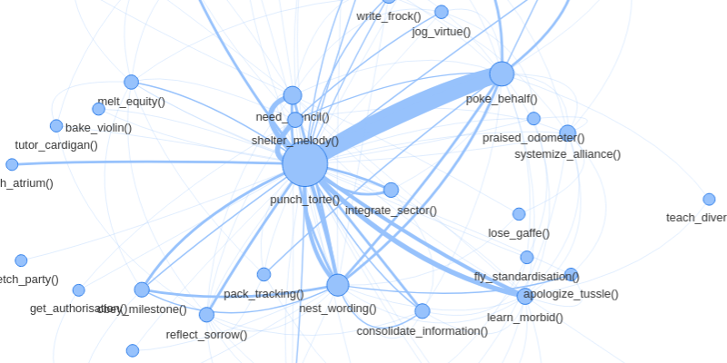
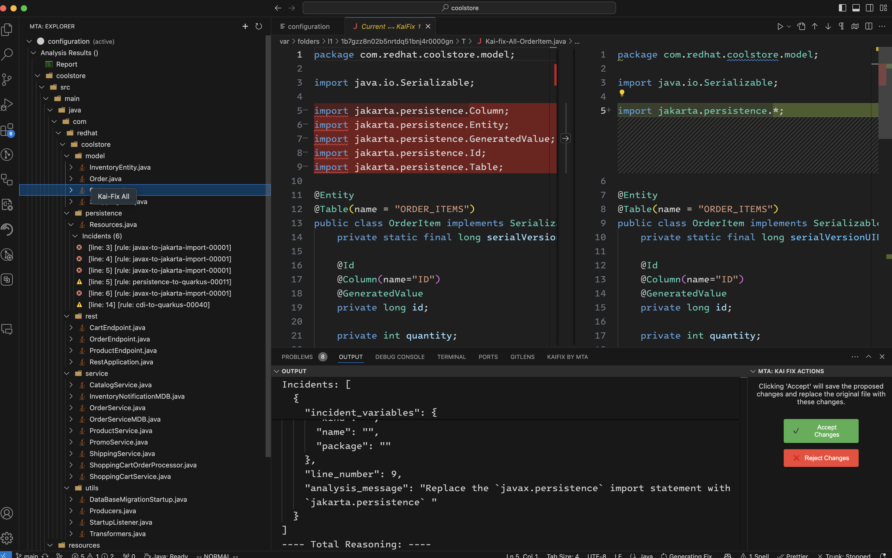
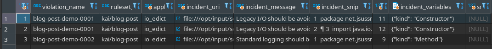
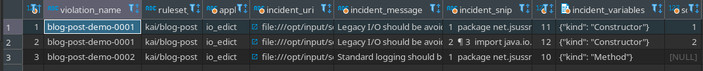

**Author**: Jonah Sussman ([GitHub](https://www.GitHub.com/jonahsussman/), [LinkedIn](https://www.linkedin.com/in/jonahsussman/), [E-mail](mailto:jsussman@redhat.com))

## Introduction

The process of modernizing an application is complex and time-consuming. Despite
our best efforts as software engineers with things like [semantic
versioning](https://semver.org/), detailed release notes, and thorough testing,
modernizing a single application is an intimidating task.

This kind of work is often one of the most unglamorous, and error-prone tasks
that developers have to do. It involves rewriting large portions of the
codebase, which can daunting for even the most battle-hardened of developers.
There's an interconnected web of functions, classes, and modules that all depend
on each other. One wrong move and the whole thing can come crashing down. 



Now imagine you have to do this across _tens_ or _hundreds_ of applications.

<br />

Yeesh.

## Enter: Kai

[**Kai**](https://www.github.com/konveyor/kai/) is an AI-enabled tool that assists
with _modernizing applications_. Kai is designed to help developers write code
more efficiently by providing suggestions and solutions to common problems. It
does this by using _analysis reports from Konveyor_ about the codebase and
generating solutions based on what it finds.



Now, you may be thinking: _How is Kai different than other generative AI tools?_
I'm so glad you asked.

- **Konveyor's analysis reports**: Konveyor generates analysis reports
  throughout a migration. This history of reports tells you what's wrong with
  your codebase, where the issues are, and when they happened. Best of all, this
  functionality exists _today_. Developers are already doing this during a
  migration! As a result...
- **Kai can learn throughout a migration**: As you migrate more pieces of your
  codebase with Kai, it can learn from the data available, and get better
  recommendations for the next application, and the next, and so on. This leads
  to the fact that...
- **Kai is more focused**: LLMs are very powerful tools, but without explicit
  guidance, they can generate a lot of garbage. Using Konveyor's analysis
  reports allows us to focus Kai's generative power on the specific problems
  that need to be solved. _Pointed_, _specific data_ is the key to unlocking the
  full potential of large language models.

Recently, we overhauled how incidents are handled inside Kai. I'm going to take
you on a guided tour through these changes, and learn how Kai operates in a
deep, technical level.

## An Initial Migration

Let's imagine we're a developer for Bloopify Solutions. Stick with me here,
there's going to be a fair amount of code snippets. You can follow along with
the migration using [this
repository](https://github.com/JonahSussman/kai-tester/). Now, suppose we have
the following Java application:

```java
package net.jsussman.ioedict;

import java.io.FileInputStream;
import java.io.FileOutputStream;
import java.io.IOException;

public class App {
  public static void main(String[] args) {
    System.out.println("Starting application!");

    try (FileInputStream in = new FileInputStream("input.txt");
        FileOutputStream out = new FileOutputStream("output.txt")) {

      int c;
      while ((c = in.read()) != -1) {
        out.write(c);
      }
    } catch (IOException e) {
      e.printStackTrace();
    }
  }
}
```

Beautiful, isn't it? Now, let's say we have received an edict from on high that
we can longer use old-school input/output from the Java IO package and standard
logging via `System.out`. We decide to write a couple of rules to enforce this:

```yaml
- ruleID: blog-post-demo-0001
  category: mandatory
  description: Avoid old-school input/output
  effort: 5
  message: Legacy I/O should be avoided. Consider using NIO (java.nio) instead.
  when:
    java.referenced:
      location: CONSTRUCTOR_CALL
      pattern: java.io.*

- ruleID: blog-post-demo-0002
  category: mandatory
  description: Avoid standard logging
  effort: 5
  message: Standard logging should be avoided. Consider using SLF4J instead.
  when:
    java.referenced:
      pattern: "System*"
```

We feed this to Konveyor and presto! It generates an analysis report back for
us:

```yaml
- name: kai/blog-post
  description: Rules focused on demonstrating the capabilities of Kai
  violations:
    blog-post-demo-0001:
      description: Avoid old-school input/output
      category: mandatory
      incidents:
      - uri: file:///opt/input/source/src/main/java/net/jsussman/ioedict/App.java
        message: Legacy I/O should be avoided. Consider using NIO (java.nio) instead.
        codeSnip: # ... code snippet here ...
        lineNumber: 11
        variables:
          file: file:///opt/input/source/src/main/java/net/jsussman/ioedict/App.java
          kind: Constructor
          name: main
          package: net.jsussman.ioedict
      - uri: file:///opt/input/source/src/main/java/net/jsussman/ioedict/App.java
        message: Legacy I/O should be avoided. Consider using NIO (java.nio) instead.
        codeSnip: # ... code snippet here ...
        lineNumber: 12
        variables:
          file: file:///opt/input/source/src/main/java/net/jsussman/ioedict/App.java
          kind: Constructor
          name: main
          package: net.jsussman.ioedict
      effort: 5
    blog-post-demo-0002:
      description: Avoid standard logging
      category: mandatory
      incidents:
      - uri: file:///opt/input/source/src/main/java/net/jsussman/ioedict/App.java
        message: Standard logging should be avoided. Consider using SLF4J instead.
        codeSnip: # ... code snippet here ...
        lineNumber: 9
        variables:
          file: file:///opt/input/source/src/main/java/net/jsussman/ioedict/App.java
          kind: Method
          name: main
          package: net.jsussman.ioedict
      effort: 5
```

Look at that! Each rule was **violated**, with two **incidents** for the io and
one for the logging. Now, let's fix the io issue:

```java
package net.jsussman.ioedict;

import java.io.IOException;
import java.nio.file.Files;
import java.nio.file.Path;
import java.nio.file.Paths;

public class App {
  public static void main(String[] args) {
    System.out.println("Starting application!");

    Path source = Paths.get("input.txt");
    Path destination = Paths.get("output.txt");
    try {
      Files.copy(source, destination);
    } catch (IOException e) {
      e.printStackTrace();
    }
  }
}
```

I promise we're going to get to the good stuff soon. Finally, Konveyor generates
another report for us:

```yaml
- name: kai/blog-post
  description: Rules focused on demonstrating the capabilities of Kai
  violations:
    blog-post-demo-0002:
      description: Avoid standard logging
      category: mandatory
      incidents:
      - uri: file:///opt/input/source/src/main/java/net/jsussman/ioedict/App.java
        message: Standard logging should be avoided. Consider using SLF4J instead.
        codeSnip: # ... code snippet here ...
        lineNumber: 10
        variables:
          file: file:///opt/input/source/src/main/java/net/jsussman/ioedict/App.java
          kind: Method
          name: main
          package: net.jsussman.ioedict
      effort: 5
  unmatched:
  - blog-post-demo-0001
```

We solved the io issue, but left the logging issue (this will be important for
later). Now, let's see how Kai uses this data to generate solutions.

## The Solution Pipeline

At the core of Konveyor's analysis reports (and by extension, Kai) is the humble
**incident**. An incident is a code location in a file that signals something is
wrong. It could be a bug, a security vulnerability, or a code smell. 

You can view Kai's input as a snapshot of code at a particular point in time,
and the incidents associated with it. It's Kai's job to use these incidents and
generate **solutions** for them. Solutions are generated as a part of a
highly-configurable pipeline, consisting of:

- **Solution Detectors**: Classify incidents as unsolved, solved, or new.
- **Solution Producers**: Generate a solution for a solved incident.
- **Solution Consumers**: Turn the solution into something that an LLM can use.

## Solution Detection

At a fundamental level, the job of a solution detector is to classify which
incidents are unsolved, solved, or new. It's given the old and new Report
objects, as well as references to the git repo before and after the changes.
They then perform their specific detection algorithm and spit out the classified
incidents.

Currently, there are two types of detectors:
- **naive**: Incidents are considered “the same” if everything matches.
- **line_match**: Incidents on different lines that are merely moved or can be
  matched to some other area of the AST are considered the same as well.

Returning to our hypothetical job at Bloopify Solutions, let's see what the
database of incidents looks like after loading the project before fixing the io issue:



This is exactly what we expect. The report has been loaded successfully, and
there are no solutions attached to the incidents. Now, let's see what it looks
like after loading the project after fixing the io issue with the `line_match`
solution detector:



Kai has correctly identified that the io issue has been fixed and marked both
incidents as solved. The logging issue remains unsolved. (Even though it was on
a different line!)

Now that we've seen Kai correctly mark which incidents are solved, let's see how
it produces solutions.

### Solution Producers

Solution producers take an incident that's been solved and generate a solution.
Solutions are stored in Kai as flexible JSON, allowing for growth as the
application evolves. A user can opt into and out of different solution
detectors, producers, and consumers very fluidly, leaving maximum
configurability for how we handle it on the table.

Currently, there are two types of producers:

- **text_only**: The solution only contains a textual difference between the old
  and new.
- **llm_lazy**: The same as text_only as well as the solution is earmarked for
  LLM summary generation. The llm summary is the generated only when the
  solution is needed, i.e. lazily.

Let's take a look at the solutions generated by Kai for one of the incidents
of the io issue:

```json
{
  "uri": "file:///opt/input/source/src/main/java/net/jsussman/ioedict/App.java",
  "generated_at": "2024-08-22T17:35:31.979627",
  "file_diff": "diff --git ... rest of diff here ...",
  "repo_diff": null,
  "original_code": "... full original code here ...",
  "updated_code": "... full updated code here ...",
  "llm_summary_generated": false,
  "llm_summary": null
}
```

We can see that the solution contains a variety of information, including the
diff between the old and new code. Additionally, since we selected the
`llm_lazy` producer, the solution is earmarked for LLM summary generation (note
that `llm_summary_generated` is `false` and not `null`).

This is fantastic. We have a solution for the io issue that we can use to
generate solutions to future incidents of this problem. Now, let's see how we
can do that.

### Solution Consumers

The history of solutions is stored in the database. During a migration, we can
search this database for potential solutions to our problem. Once the solution
is found, we consume it by turning it into something that an LLM can use. Right
now, all producers take in a solution and build a string that can be pasted into
the prompt. 

Additionally, consumers can perform additional post-processing work once a
solution is ready to be used. This is so that we only have to do as much work as
we need; we don't want to hammer our LLM API endpoints. 

> It's also through this mechanism that we can implement the next phase of
Kai, so stay tuned!.

Going back to our migration at Bloopify Solutions, let's say we have this
separate application:

```java
package io.konveyor.filer;

import java.io.File;
import java.io.FileInputStream;
import java.io.FileOutputStream;
import java.io.IOException;

public class App {
  public static void main(String[] args) {
    File sourceDir = new File("source_directory");
    File destDir = new File("destination_directory");

    try {
      copyDirectoryLegacyIO(sourceDir, destDir);
      System.out.println("Directory copied successfully using legacy I/O.");
    } catch (IOException e) {
      e.printStackTrace();
    }
  }

  public static void copyDirectoryLegacyIO(File source, File destination) throws IOException {
    if (source.isDirectory()) {
      if (!destination.exists()) {
        destination.mkdirs(); // Create destination directory if it doesn't exist
      }
      String[] children = source.list();
      if (children != null) {
        for (String child : children) {
          copyDirectoryLegacyIO(new File(source, child), new File(destination, child));
        }
      }
    } else {
      copyFileLegacyIO(source, destination);
    }
  }

  private static void copyFileLegacyIO(File source, File destination) throws IOException {
    try (FileInputStream in = new FileInputStream(source);
        FileOutputStream out = new FileOutputStream(destination)) {

      byte[] buffer = new byte[1024];
      int bytesRead;
      while ((bytesRead = in.read(buffer)) != -1) {
        out.write(buffer, 0, bytesRead);
      }
    }
  }
}
```

Konveyor comes back to us with the following report (get ready for a doozy of a report):

```yaml
- name: kai/blog-post
  description: Rules focused on demonstrating the capabilities of Kai
  violations:
    blog-post-demo-0001:
      description: Avoid old-school input/output
      category: mandatory
      incidents:
      - uri: file:///opt/input/source/src/main/java/io/konveyor/filer/App.java
        message: Legacy I/O should be avoided. Consider using NIO (java.nio) instead.
        codeSnip: # ... code snippet here ...
        lineNumber: 10
        variables:
          file: file:///opt/input/source/src/main/java/io/konveyor/filer/App.java
          kind: Constructor
          name: main
          package: io.konveyor.filer
      - uri: file:///opt/input/source/src/main/java/io/konveyor/filer/App.java
        message: Legacy I/O should be avoided. Consider using NIO (java.nio) instead.
        codeSnip: # ... code snippet here ...
        lineNumber: 11
        variables:
          file: file:///opt/input/source/src/main/java/io/konveyor/filer/App.java
          kind: Constructor
          name: main
          package: io.konveyor.filer
      - uri: file:///opt/input/source/src/main/java/io/konveyor/filer/App.java
        message: Legacy I/O should be avoided. Consider using NIO (java.nio) instead.
        codeSnip: # ... code snippet here ...
        lineNumber: 29
        variables:
          file: file:///opt/input/source/src/main/java/io/konveyor/filer/App.java
          kind: Constructor
          name: copyDirectoryLegacyIO
          package: io.konveyor.filer
      - uri: file:///opt/input/source/src/main/java/io/konveyor/filer/App.java
        message: Legacy I/O should be avoided. Consider using NIO (java.nio) instead.
        codeSnip: # ... code snippet here ...
        lineNumber: 38
        variables:
          file: file:///opt/input/source/src/main/java/io/konveyor/filer/App.java
          kind: Constructor
          name: copyFileLegacyIO
          package: io.konveyor.filer
      - uri: file:///opt/input/source/src/main/java/io/konveyor/filer/App.java
        message: Legacy I/O should be avoided. Consider using NIO (java.nio) instead.
        codeSnip: # ... code snippet here ...
        lineNumber: 39
        variables:
          file: file:///opt/input/source/src/main/java/io/konveyor/filer/App.java
          kind: Constructor
          name: copyFileLegacyIO
          package: io.konveyor.filer
      effort: 5
    blog-post-demo-0002:
      description: Avoid standard logging
      category: mandatory
      incidents:
      - uri: file:///opt/input/source/src/main/java/io/konveyor/filer/App.java
        message: Standard logging should be avoided. Consider using SLF4J instead.
        codeSnip: # ... code snippet here ...
        lineNumber: 15
        variables:
          file: file:///opt/input/source/src/main/java/io/konveyor/filer/App.java
          kind: Method
          name: main
          package: io.konveyor.filer
      effort: 5
```

Ouch! Migrating this by hand would certainly be a pain. But now, Kai is loaded
with examples of how to fix these issues. Let's make a request to Kai to
generate a solution for the io issue. First, it generates the LLM summary for
the solutions it's using:

```md
## Reasoning

1. **Identify the problem**: The incident report states that legacy I/O should be avoided and NIO should be used instead. The code in question is using Java's legacy I/O classes `FileInputStream` and `FileOutputStream` to read and write files.

2. **Understand the solution**: The solution provided uses the `java.nio` package, specifically the `Files` class, to copy the contents of one file to another. This is a more modern and efficient way to handle I/O operations.

3. **Implement the solution**: To implement this solution, we first import the necessary classes from the `java.nio.file` package. We then replace the `FileInputStream` and `FileOutputStream` with the `Paths` and `Files` classes. The `Paths.get()` method is used to get the file paths, and the `Files.copy()` method is used to copy the contents of the source file to the destination file.

## Additional Information

The `Files.copy()` method throws a `IOException` if an I/O error occurs, so we wrap it in a try-catch block to handle this exception. This is similar to how the original code handles exceptions thrown by the `read()` method of the `FileInputStream`. 

The `Files` class also provides other useful methods for working with files, such as `Files.exists()`, `Files.delete()`, and `Files.move()`, which can be used for various file management tasks. 

It's also worth noting that the `Files.copy()` method can be used to copy a file to a new location, or to replace an existing file. If the destination file already exists, it will be deleted before the copy operation begins. If you want to keep the existing file and append to it instead, you can use the `Files.newOutputStream()` method with the `APPEND` option.
```


And it comes back with the following code:

```java
package io.konveyor.filer;

import java.io.IOException;
import java.nio.file.*;
import java.nio.file.attribute.BasicFileAttributes;

public class App {
  public static void main(String[] args) {
    Path sourceDir = Paths.get("source_directory");
    Path destDir = Paths.get("destination_directory");

    try {
      copyDirectoryNIO(sourceDir, destDir);
      System.out.println("Directory copied successfully using NIO.");
    } catch (IOException e) {
      e.printStackTrace();
    }
  }

  public static void copyDirectoryNIO(Path source, Path destination) throws IOException {
    if (Files.notExists(destination)) {
      Files.createDirectories(destination);
    }

    Files.walkFileTree(source, new SimpleFileVisitor<Path>() {
      @Override
      public FileVisitResult visitFile(Path file, BasicFileAttributes attrs) throws IOException {
        Path destFile = destination.resolve(source.relativize(file));
        Files.copy(file, destFile, StandardCopyOption.REPLACE_EXISTING);
        return FileVisitResult.CONTINUE;
      }

      @Override
      public FileVisitResult preVisitDirectory(Path dir, BasicFileAttributes attrs) throws IOException {
        Path destDir = destination.resolve(source.relativize(dir));
        if (Files.notExists(destDir)) {
          Files.createDirectories(destDir);
        }
        return FileVisitResult.CONTINUE;
      }
    });
  }
}
```

This is fantastic! We have a solution for the io issue for this entirely
separate application, based on the history of solutions Kai has generated.


## Conclusion

In conclusion, Kai is a powerful tool that leverages Konveyor's analysis reports
to generate solutions for common problems in codebases. By using pointed,
specific data, Kai can focus its generative power on the specific problems that
need to be solved. This allows developers to write code more efficiently and
modernize their applications with confidence. 

I hope this deep dive into Kai's incident storage has given you a better
understanding of how Kai operates and how it can be used to improve the
generation of results. If you have any questions or would like to learn more
about Kai, feel free to reach out to me on
[GitHub](https://www.GitHub.com/jonahsussman/) or even contribute to the project
at [Konveyor's GitHub](https://www.github.com/konveyor/kai/).
