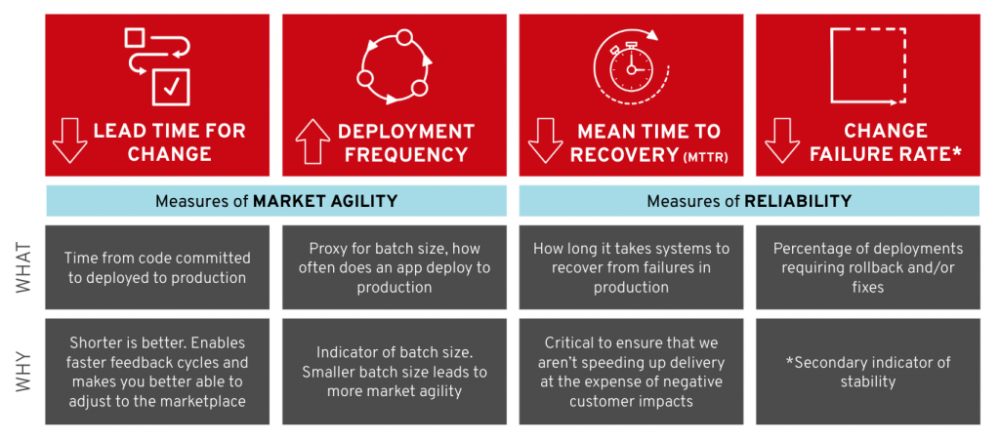

My team has been working with organizations adopting containers, Kubernetes, and Red Hat OpenShift for more than three years now. When we started providing professional services around enterprise Kubernetes, it became clear we needed a program-level framework for adopting containers that spelled out the activities of multiple project teams. Some participants would be focused on container platform management and operations, some on continuous delivery, some on the application lifecycle, and others on cross-cutting process transformation.

We’ve had success using this framework to help customers rethink container adoption as less a matter of new technology implementation and more as an “organizational journey,” where people and process concerns are at least as important as the successful deployment of OpenShift clusters.

Over time, we’ve realized the program framework is missing a guiding force that gets executive stakeholders engaged and can keep all participants focused on a consistent, meaningful set of objectives. Too often, we’ve seen IT and development managers concentrated on narrow, tactical objectives that don’t drive the big-picture, transformational needs of those enterprises. What we felt was lacking was a set of trackable and meaningful measures that could demonstrate progress to stakeholders in a more visible way.

We were very excited by the release of [Accelerate](https://www.infoq.com/articles/book-review-accelerate) by Dr. Nicole Forsgren, Jez Humble, and Gene Kim last year as the culmination of “a four-year research journey to investigate what capabilities and practices are important to accelerate the development and delivery of software, and, in turn, value to companies.” The authors, known for their work on Puppet Labs’ _State of DevOps_ reports and books like _Continuous Delivery_ and _The Phoenix Project_, were able to use survey data and statistical analysis to show relationships between specific capabilities/practices and organizational performance.

One of these capabilities, software delivery performance, should be of particular interest to organizations undergoing cloud adoption and/or the digital transformation. Forsgren and her co-authors showed a statistical link between software delivery performance and organization performance, including financial indicators like profitability, productivity, market share, and number of customers. Interestingly, the authors showed a link between software delivery performance and _non-commercial_ performance as well: things like product quality, customer satisfaction, and achieving mission goals.

Equally important, the authors defined software delivery performance in a concrete, measurable way that can be used as indicators for a range of transformative practices and capabilities. They defined software delivery performance using four metrics: Lead Time, Deployment Frequency, Mean Time to Recovery, and Change Failure Rate, described below.

Finally, the authors enumerated the various practices and capabilities that drive software delivery performance as measured this way: test automation, deployment automation, loosely coupled architecture, and monitoring, among others.

What this means is that we have specific measures that adopters of container platforms (among other emerging technologies) can use to guide how the technology is adopted in ways that can lead to better organizational performance. And we have a set of practices that can be applied against this technology backdrop, using containers and container platform as accelerators of those practices when possible.

The focus for the authors is on global performance, not local optimization, and on “outcomes not output,” so the organization rewards activities that matter, rather than sheer volume of activity. This last point is crucial. In an [earlier post](https://blog.openshift.com/assessing-app-portfolios-for-onboarding-to-openshift/), I wrote about app onboarding to OpenShift. Taken to the extreme, a myopic focus on the percentage of the portfolio or number of apps migrated to X (containers, Kubernetes, OpenShift, AWS, “The Cloud”) is a focus on _outputs not outcomes_. It’s a measure that seems to indicate progress but does not directly determine the success of the cloud adoption program as a whole, success that must involve some wider notion of commercial or noncommercial performance.

Put another way, cloud platforms do not automatically confer continuous delivery capabilities upon their adopters. They enable them. They accelerate them. But without changing the way we deliver software as an organization — the way we work — cloud technology (or any other newly introduced technology) will probably fail to match its promise.

I will be writing more about how we put a metrics-based approach into practice with our customers in upcoming posts, starting with an update on how we’ve begun to capture these metrics in dashboards to keep stakeholders and project participants aligned to meaningful goals.
