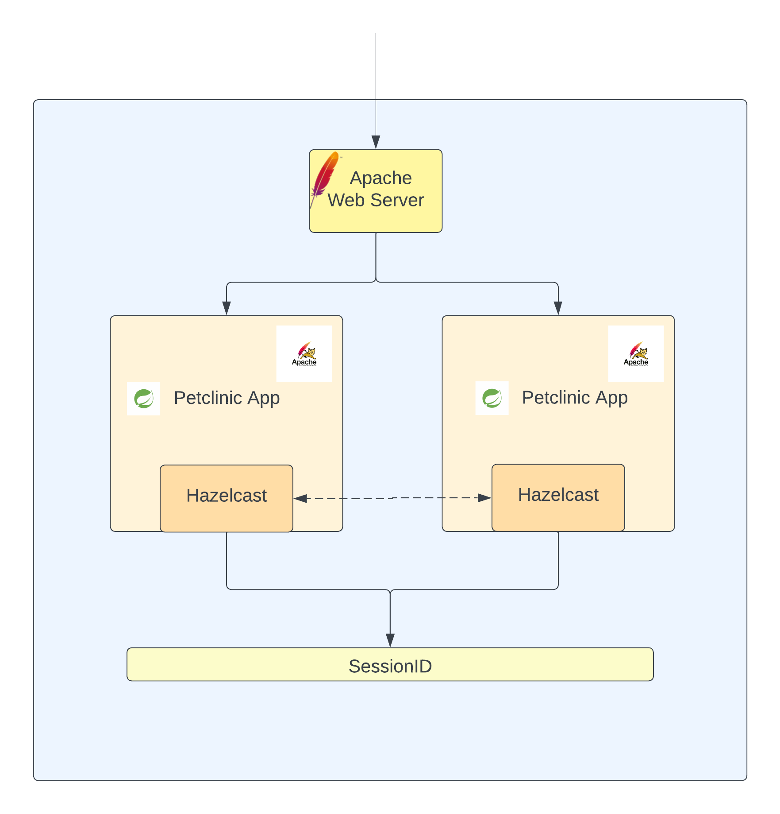
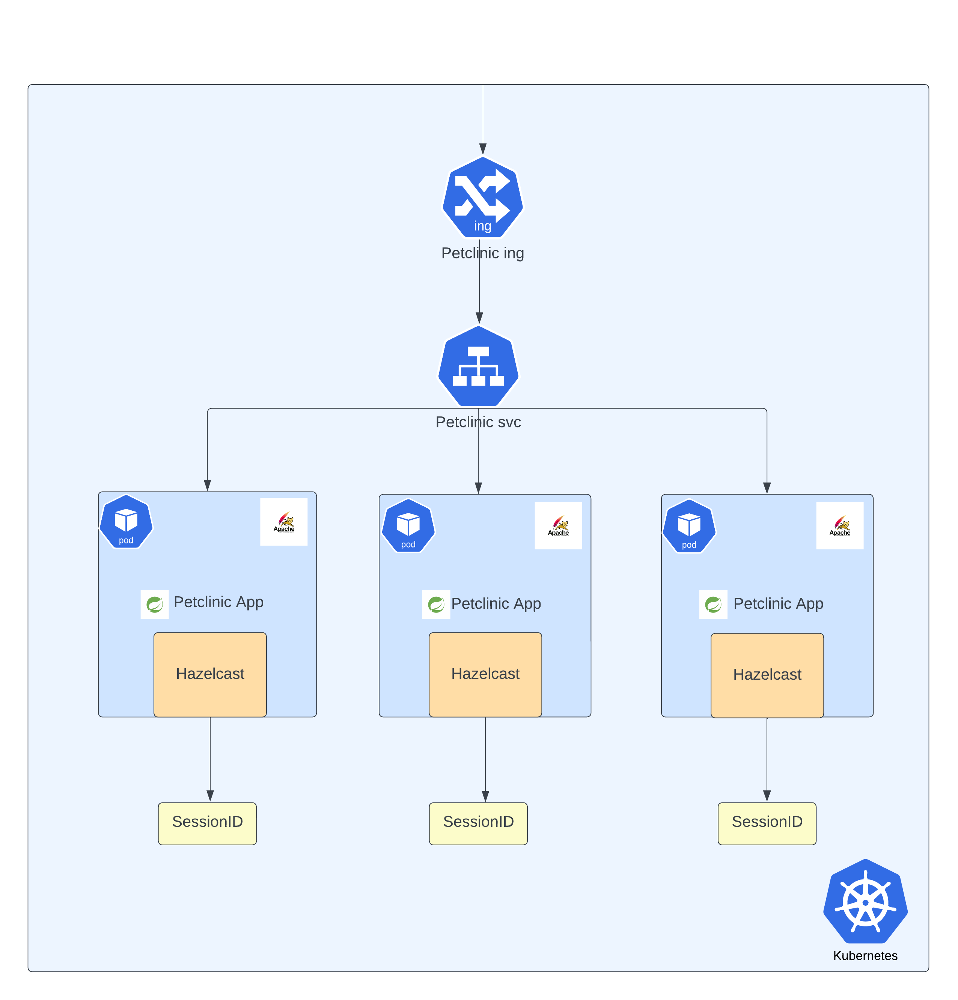
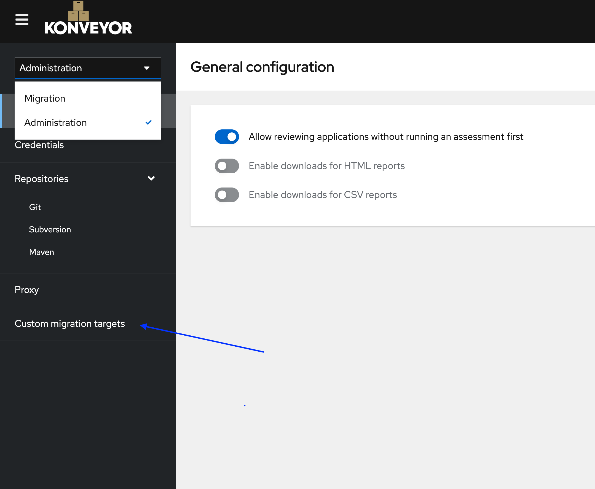
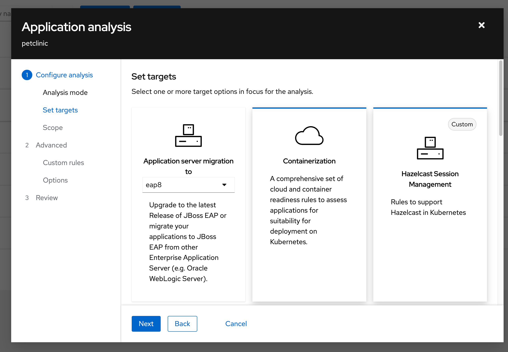
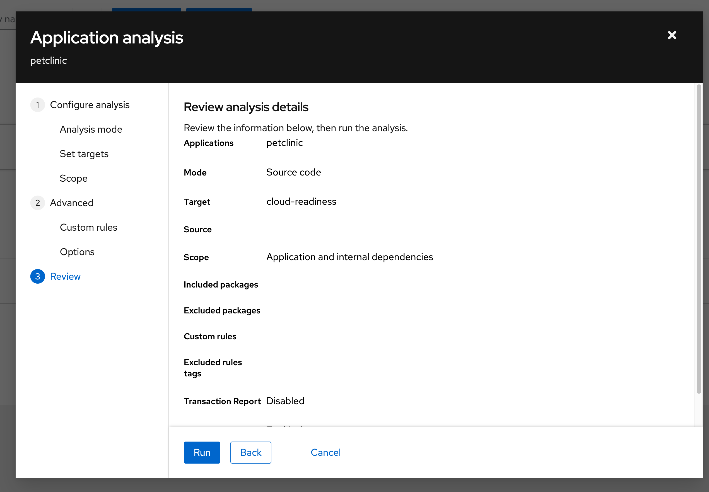
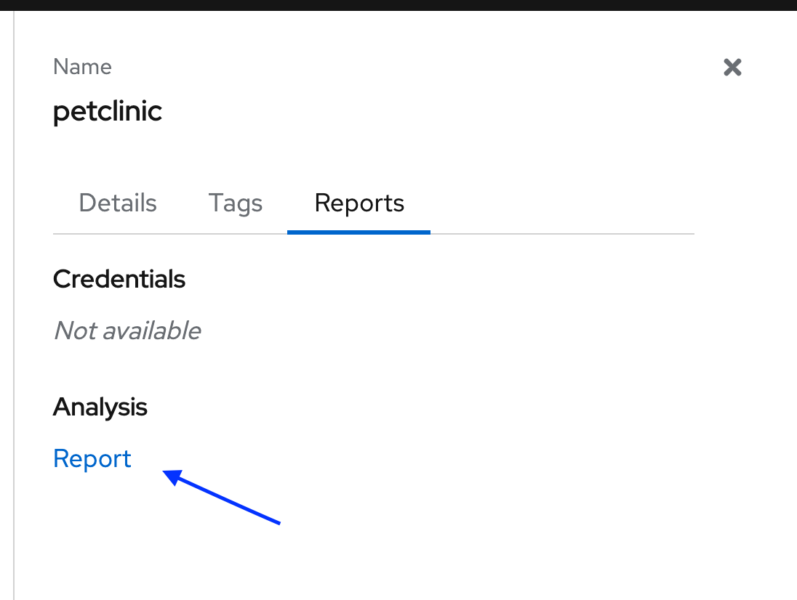
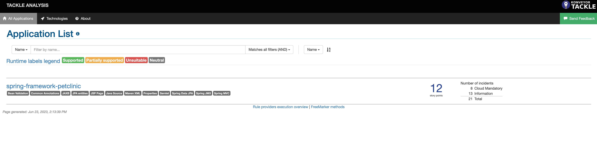
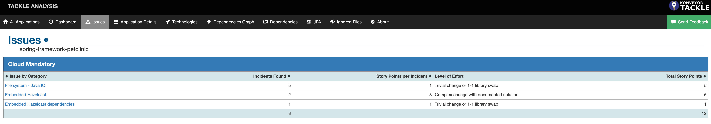
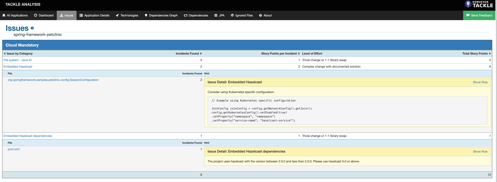
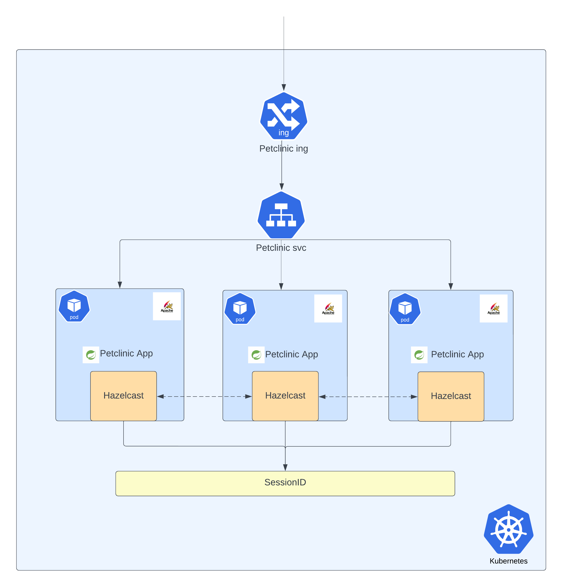

**Author**: [Savitha Raghunathan](https://github.com/savitharaghunathan)

Konveyor aims to surface insights on applications at scale to empower enterprise users to make better-informed decisions related to modernization activities. When it comes to migrating applications to Kubernetes (K8s), it's important to note that some applications can be ported without any major issues. However, there are certain edge cases where applications may encounter difficulties during the migration process. One such edge case we will focus on in this tutorial involves Hazelcast. Hazelcast is an open-source in-memory data grid that provides distributed caching and data synchronization capabilities. In this tutorial, we will use Hazelcast as the session backing store. During the migration of an application utilizing Hazelcast, some issues arise due to the distributed nature of Hazelcast and the dynamic nature of a Kubernetes environment. In this specific case, network connectivity and discovery issues impact the functionality of the petclinic application.

To tackle this challenge, the tutorial will not only guide you on how to identify and translate specific edge case issues into custom rules but also emphasize the long-term benefits of sharing this knowledge within the organization. By investing time and effort in creating custom rules for this particular application, you are laying the groundwork for future migrations and modernizations throughout the app portfolio. Once we have integrated these custom rules as targets with Konveyor, we will gain valuable insights that can be applied to other applications in the portfolio. This knowledge-sharing mechanism allows others in the organization to quickly recognize similar issues and provides a clear path for resolving them.

While creating custom rules may require additional effort initially, the resulting knowledge base will serve as a valuable resource for scaling these efforts across teams. It's not just about solving the problem for one application; it's about empowering others in the organization to handle future modernizations and migrations more efficiently. By sharing the insights gained from Konveyor and the custom rules, you contribute to the overall growth of knowledge and shorten the learning curve for future projects.

## Goals:

* This example will explore the reasons behind the failed attempt to lift and shift the petclinic app to Kubernetes. 
* We will leverage the lessons learned from this experience to develop custom rules and a target. We will then use the custom target with the Konveyor Analyzer module to analyze the application.
*  By implementing the recommended changes identified in the preceding step, we will refactor and deploy the app to Kubernetes.


## Background: 
The [Petclinic app](https://github.com/konveyor/spring-framework-petclinic/tree/legacy) has been modified to replicate the behavior of a real-world enterprise application. In this updated version, Hazelcast is used as the backing store to handle anonymous users' sessions. The application leverages Spring Session management, which facilitates clustered sessions beyond the limitations of an application container-specific solution. Consequently, multiple instances of the Petclinic application can utilize a shared store for user sessions. In this example, the Petclinic application instances utilize Hazelcast as an HTTP session store, enabling the instances to share sessions. This setup guarantees uninterrupted user sessions even if an instance becomes unavailable.



## Prerequisites 
* [EKS v1.25 or above](https://github.com/konveyor/hack_env_helpers/blob/main/aws/eks/README.md)
* [Konveyor Operator](https://konveyor.github.io/konveyor/installation/) 

## Walkthrough:
This walkthrough has the following three parts,
1. Lift and shift to Kubernetes
2. Analyze the app using Konveyor custom rules 
3. Refactor and deploy to Kubernetes

### Part 1: Lift and Shift to Kubernetes

In this section, we will take the [modified petclinic app](https://github.com/konveyor/spring-framework-petclinic/tree/legacy) and deploy it in a Kubernetes Cluster and explore the reasons why the user session wasn't replicated.

1. Deploy the application to Kubernetes
```
kubectl apply -f https://raw.githubusercontent.com/konveyor/spring-framework-petclinic/legacy/petclinic-legacy.yaml
```

**_Note: Please edit the ingress annotations to suit your ingress provider. The above deployment uses ALB for ingress._**

2. After deployment, check if the resources are available
```
kubectl -n petclinic-legacy get all,ing
```
The output should resemble the following,
```
$ kubectl -n petclinic-legacy get all,ing
NAME                                   READY   STATUS    RESTARTS   AGE
pod/petclinic-legacy-d854c89f5-cgfch   1/1     Running   0          82s
pod/petclinic-legacy-d854c89f5-j6b4l   1/1     Running   0          82s
pod/petclinic-legacy-d854c89f5-xw78q   1/1     Running   0          82s

NAME                       TYPE        CLUSTER-IP      EXTERNAL-IP   PORT(S)    AGE
service/petclinic-legacy   ClusterIP   10.100.93.168   <none>        8080/TCP   82s

NAME                               READY   UP-TO-DATE   AVAILABLE   AGE
deployment.apps/petclinic-legacy   3/3     3            3           83s

NAME                                         DESIRED   CURRENT   READY   AGE
replicaset.apps/petclinic-legacy-d854c89f5   3         3         3       83s

NAME                                         CLASS   HOSTS   ADDRESS                                                                   PORTS   AGE
ingress.networking.k8s.io/petclinic-legacy   alb     *       k8s-petclini-petclini-20798acd3f-1994483574.us-east-1.elb.amazonaws.com   80      82s
```

Once the ingress is available, access the application with the format `<ingress-url>/petclinic`. eg: `http://k8s-petclini-petclini-20798acd3f-1994483574.us-east-1.elb.amazonaws.com/petclinic/`

Here's the high-level view of the deployment,



3. Browse through the application. You will notice that the session data changes with every request.

[Click here to watch the video for part 1 in action - Lift and Shift deployment of Petclinic to K8s](https://www.youtube.com/watch?v=PTQdMHqjZzU)
<YouTube youTubeId="PTQdMHqjZzU" />

### Why did the deployment fail? 
* Based on the information from pod logs, it appears that each pod in the Kubernetes cluster has its own Hazelcast cluster. This means that each instance of the application has its own session backing store, resulting in session inconsistency. As requests are served by different pods in a round-robin fashion, the session keeps changing, which can cause issues with session management and data synchronization.

* The root cause of this problem seems to be a failure in the automatic member discovery feature of Hazelcast. The app relies on TCP/IP for member discovery, but the address specified in the application configuration is not accessible from the Kubernetes cluster. 

#### Solution

* To fix this issue, updating the Hazelcast dependency to a version that is compatible with Kubernetes is recommended. 
* Furthermore, the discovery method implemented in the codebase is not performing as expected in the Kubernetes (K8s) environment. Since the app is configured to use embedded Hazelcast and the deployment is not a statefulset, it is not possible to predict the IP addresses of the pods to configure the TCP/IP discovery method. A possible solution would be to configure Multicast discovery but it requires a secure network environment due to the broadcasting of packets, allowing any member with the appropriate cluster name to join the cluster, which grants less control over the cluster. In the given scenario, it is recommended to utilize the Kubernetes discovery plugin for effective embedded Hazelcast cluster management.

*Note: This is one of the many solutions that are applicable in this scenario. This example aims at walking through the troubleshooting process and converts the knowledge gained into custom rules for future app migrations*

### Part 2: Analyze the Petclinic App using Konveyor Custom Rules

##### Step 1
* Based on the lessons learned from the previous section, let's develop custom rules that incorporate the identified issues and their corresponding solutions.

```
<?xml version="1.0"?>
<ruleset id="HZRules"
	xmlns="http://windup.jboss.org/schema/jboss-ruleset"
	xmlns:xsi="http://www.w3.org/2001/XMLSchema-instance"
	xsi:schemaLocation="http://windup.jboss.org/schema/jboss-ruleset http://windup.jboss.org/schema/jboss-ruleset/windup-jboss-ruleset.xsd">

	<metadata>
		<description>
			This ruleset detects embedded hazelcast, which may be problematic
			when migrating an application to a cloud environment.
		</description>
		<dependencies>
			<addon id="org.jboss.windup.rules,windup-rules-javaee,3.0.0.Final" />
			<addon id="org.jboss.windup.rules,windup-rules-java,3.0.0.Final" />
		</dependencies>

		<targetTechnology id="cloud-readiness" />

		<tag>Hazelcast</tag>
	</metadata>
	<rules>
		<rule id="hazelcast-cloud-readiness-hz001">
			<when>
				<or>
					<javaclass
						references="com.hazelcast.config.JoinConfig.getMulticastConfig({*})">
						<location>METHOD_CALL</location>
					</javaclass>
					<javaclass
						references="com.hazelcast.config.JoinConfig.getTcpIpConfig({*})">
						<location>METHOD_CALL</location>
					</javaclass>
				</or>
			</when>
			<perform>
				<hint title="Embedded Hazelcast"
					category-id="cloud-mandatory" effort="3">
					<message> Consider using Kubernetes specific configuration.
					<![CDATA[
							// Example using Kubernetes specific configuration
							
							JoinConfig joinConfig = config.getNetworkConfig().getJoin();
							config.getKubernetesConfig().setEnabled(true)
							                      .setProperty("namespace", "namespace")
							                      .setProperty("service-name", "hazelcast-service");
							]]>
				</message>
				</hint>
			</perform>
		</rule>
		
		<rule id="hazelcast-cloud-readiness-hz002">
			<when>
				<project>
					<artifact groupId="com.hazelcast" artifactId="hazelcast"
						fromVersion="2.0.0" toVersion="4.2.7" />
				</project>
			</when>
			<perform>
			<hint title="Embedded Hazelcast dependencies"
					category-id="cloud-mandatory" effort="1">
					<message>The project uses hazelcast with the version between 2.0.0 and less than 5.0.0. Please use hazelcast 5.0 or above. </message>T
				</hint>
				
			</perform>
		</rule>
	</rules>
</ruleset>
```

*Rule 1: hazelcast-cloud-readiness-hz001* :
Looks for the discovery methods that are not working as expected in Kubernetes and suggest a solution that works in the Kubernetes environment.


*Rule 2: hazelcast-cloud-readiness-hz002* :
If the Hazelcast dependency is between version 2.0 and 4.2.7, it advises upgrading the dependency to version 5.0.0 or above

##### Step 2
* Let's integrate these custom rules into the Konveyor UI, so that it is easily accessible during the application analysis phase.

a. Open the Konveyor UI and Navigate to the 'Administrator' view
b. Click on the `Custom Migration Targets` link from the side navigation. 

c. Click on the 'Create New' button in the upper right corner to open the `New Custom Target` wizard.
* Download the custom rule from [here](https://gist.github.com/savitharaghunathan/8e743daa96fc8f23da511b95d44fc2b1) and save it with an extension '.windup.xml'. Upload the file to the wizard and click on create button.

d. Once created, the custom target is ready to be used in the Analysis of the application.
    
##### Step 3
* Select the 'Migration' view and click on the 'Analysis' tab

a. Create an app entry called `petclinic` in the `Analysis` tab of the tackle ui. 
* Fill in the name of the application
* Expand the source code and enter the following
    * Repository Type: Git
    * Source Repository: https://github.com/konveyor/spring-framework-petclinic.git/
    * Branch: legacy
    * Root path: /

    * Click on the `Create`  button.

b. Select the `petclinic` app and click on the `Analyze` button.

* An application analysis wizard will open. 
	* Select `Source Code` in the dropdown and click the `Next` button
     
    * In the `Set Targets` pane, select `Containerization` as well as 'Hazelcast Session Management' options and click `Next`
    

    * For scope, select `Application and internal dependencies only` 
    * Keep the defaults in the Advanced section
    * Move to the `Review` pane, and click on the`Run` button
    


c. You will notice that the status of the app has been updated to `In Progess`. Wait until it changes to `Completed`.

d. Expand the app, and click on the Analysis `Report` hyperlink
    


e. Tackle Analysis dashboard gets opened in a new tab.
    

##### Step 4    
* Click on the `spring-framework-petclinic` hyperlink and a dashboard gets displayed. Navigate to the `Issues` tab where you can explore the issues. Pay attention to the ones that are categorized as `Cloud Mandatory` as they have to be addressed for a successful migration to Kubernetes.


##### Step 5
* Expand on `Embedded Hazelcast` and `Embedded Hazelcast dependencies` to view the issues. These are the result of the custom target we added in Step 2.


[Click here to watch the video for part 2 in action - Konveyor Analysis with custom rules](https://www.youtube.com/watch?v=YOlmajHAxUI)
<YouTube youTubeId="YOlmajHAxUI" />

### Part 3: Refactor and deploy to Kubernetes

By integrating the custom rules into Konveyor, you are not only addressing the specific edge case issues in the Petclinic app but also preparing to tackle similar patterns across your portfolio of applications. Let's imagine that you have several other applications in your portfolio that exhibit similar patterns. With the custom rule integrated into Konveyor, other teams and developers within your organization will benefit from the knowledge you've shared. As they scan their applications using Konveyor with the custom rules, they will be able to identify similar issues. 

To better understand the scenario, let's take a closer look at the original state of the Petclinic application code before the update. As we delved into the analysis process in part 2 of this tutorial, it became apparent that there were certain issues related to Hazelcast that needed attention. These issues were effectively flagged by the Konveyor Analysis module. In this part, we will address those issues in the petclinic app and deploy the refactored app to Kubernetes. 

* Let's apply the changes suggested in part 2 to the application. You can find the source code for the refactored app [here](https://github.com/konveyor/spring-framework-petclinic/tree/petclinic-kube)

* Before deploying the app, let's add the required RBAC permissions that allow Hazelcast to talk to the K8s API

```
kubectl apply -f https://raw.githubusercontent.com/konveyor/spring-framework-petclinic/petclinic-kube/hazelcast-kube.yaml
```

* Deploy the refactored application

```
kubectl apply -f https://raw.githubusercontent.com/konveyor/spring-framework-petclinic/petclinic-kube/petclinic.yaml
```

* Obtain the ingress of the refactored app deployment using 

```
kubectl get ing -n petclinic-kube
```
and access the app using the format `<ing-address>/petclinic`



* Navigate through the app and you will notice that the session data remains the same irrespective of the pod that is serving the request.

[Click here to watch the video for part 3 in action - Refractor and Deploy to K8s](https://www.youtube.com/watch?v=mLJcynCYPR4)
<YouTube youTubeId="mLJcynCYPR4" />

## Conclusion

* Throughout this tutorial, we have explored the capabilities of Konveyor in delivering a comprehensive overview of issues, enabling effective planning. Moreover, Konveyor offers the ability to dive deep into each issue, down to the specific line number. This functionality empowers developers to swiftly address and resolve issues without wasting time on locating their occurrence within the codebase.
* In addition, we have delved into the process of creating custom rules and custom targets, which proved invaluable for conducting thorough application analysis. By investing time in creating custom rules and integrating them into Konveyor, you are not only alleviating the burden of scanning and identifying issues for each application individually but also establishing a knowledge-sharing mechanism that enables other teams to recognize and resolve these concerns efficiently. This collaborative approach accelerates the modernization and migration process, ensuring a smoother transition for all applications within your portfolio. 

## Get involved in the Konveyor Community

The Konveyor project is actively seeking additional use cases and migration experiences to enhance the current set of rulesets. If you have valuable insights or experiences to share, we encourage you to join the Migration-experience User Group. To find out more about getting involved, please click [here]( https://github.com/konveyor/community/tree/main/ug-migration-experience).