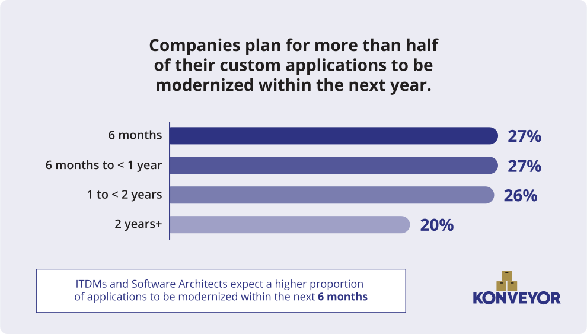
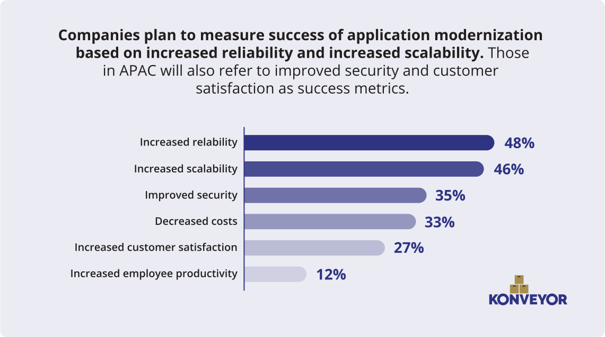
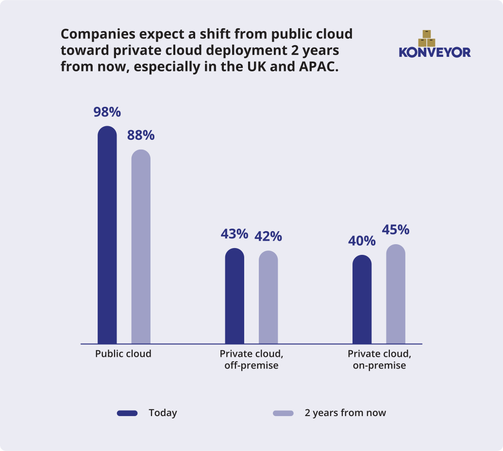

import MainCol from '../../components/main-col'
import SidebarTOC from '../../components/sidebar-toc'

<SidebarTOC>

```toc
#TOC will render here
```

</SidebarTOC>

<MainCol>

by Gordon Haff

Both anecdotes and past surveys tell us that organizations are modernizing their applications. We wanted to dig deeper into the specifics. To do so, Konveyor community contributor Red Hat sponsored a survey of 600 IT decision makers (ITDM), backend developers, and software architects in the US, UK, and English-speaking Asia-Pacific (APAC). We surveyed these respondents, drawn from third-party databases, in October and November of 2021. Their companies had to have an internal app dev team and had to be using or planning to use hybrid cloud or multicloud as well as containers (the overwhelming majority were already using both). Here are some of the things they told us.

## Modernization is happening quickly



We sought out respondents who were modernizing or planning to modernize their custom apps in some manner, so it’s no surprise that everyone we surveyed is modernizing. What’s perhaps less expected is how quickly they’re planning to modernize. Companies are planning to modernize over half of their custom applications during the next year and over a quarter during the next six months. Only 20% expected the modernization to take more than two years.

Does that seem a bit… optimistic? It does. Indeed, as was something of a theme throughout this survey, developers were less confident than their ITDM and architect counterparts that modernization would be either quick or straightforward.

The barriers cited by respondents provide additional evidence that modernization projects won’t always be smooth sailing. All regions except the UK said that resistance to change was the top barrier—and in the UK it was still near the top. The fact that this is a cultural challenge far more than a technical one suggests that overcoming such a barrier may be difficult and require senior management buy-in. Other top barriers were related concerns like time constraints, cost and budget constraints, and lack of skilled resources. Skills shortages in particular are a common theme almost across the board when we conduct surveys about important IT initiatives.

However, even if you think that a lot of modernization projects are likely to slip out, the data certainly points to an intent to rapidly modernize.

## There’s no single app modernization strategy


In considering app modernization strategies, we presented survey respondents with six choices, the widely used six Rs. These are:

- **Retire:** Sunset or decommission applications that are no longer needed
- **Retain:** Leave critical applications as-is until refactoring is required
- **Rehost:** Copy applications to a cloud (whether hosted or on-prem) with minimal changes, i.e. “lift and shift”
- **Replatform:** Use a cloud migration to upgrade operating systems, databases, and other components as needed in order to cloud-enable applications without changing core application code or architecture
- **Refactor:** Re-architect as cloud-native, for example, by containerizing workloads or moving them to a serverless architecture
- **Repurchase:** Move from perpetual licenses to a Software-as-a-Service (SaaS) model

That’s quite the range of options and they’re all being used to significant degrees. Retire and retain were each about half as popular than the four other options — which each captured about 20% of the applications being modernized. The overall story is definitely about matching the application modernization strategy to a given workload and company need rather than there being a single dominant approach across companies.

We again see developers being more cautious or pessimistic about more aggressive modernization approaches; they were more likely to intend to rehost relative to ITDMs and architects. We sometimes hear about “resume-driven development,” whereby developers supposedly want to gain experience in new technologies, even if doing so increases complexity. However, the developers in our survey were more likely to favor lower risk and lower effort approaches.

We also found that refactoring, which is the most involved modernization approach, is almost always a two-step approach. 90% of those who plan to refactor any legacy apps intend to replatform them first.

## The US is further along than others

<div className="table-container" tabindex="0">
  <table className="table table-fixed">
    <tr>
      <th></th>
      <th>US</th>
      <th>UK</th>
      <th>APAC</th>
    </tr>
    <tr>
      <th scope="row">Unique Definitions of App Modernization</th>
      <td>Using microservices architecture in the cloud</td>
      <td>Improving CI/CD</td>
      <td>Improving CI/CD</td>
    </tr>
    <tr>
      <th scope="row">Unique Reasons for App Modernization</th>
      <td>Decrease costs</td>
      <td>Decrease costs</td>
      <td>Improve security improve customer experience</td>
    </tr>
    <tr>
      <th scope="row">Unique Barriers</th>
      <td>
        <ul>
          <li>Difficulty determining the right approach</li>
          <li>Do no see the value of modernizing</li>
        </ul>
      </td>
      <td>Have not faces any barriers</td>
      <td>Have not faced any barriers</td>
    </tr>
    <tr>
      <th scope="row">Unique Challenges</th>
      <td>Difficulty determining the right approach</td>
      <td>No differentiating challenges</td>
      <td>No differentiating challenges</td>
    </tr>
    <tr>
      <th scope="row">Unique Success Measures</th>
      <td>Decreased cost</td>
      <td>increased customer satisfaction</td>
      <td>Improved security increased customer satisfaction</td>
    </tr>
    <tr>
      <th scope="row">Legacy App Strategy</th>
      <td>More likely to retire or retain applications</td>
      <td>More likely to rehost or repurchase applications</td>
      <td>Most likely to rehost or repurchase applications</td>
    </tr>
    <tr>
      <th scope="row">Unique App Modernization Priorities</th>
      <td>No differentiating Priorities</td>
      <td>Data/analytics/BI applications</td>
      <td>
        <ul>
          <li>Customer-facing applications</li>
          <li>Data/analytics/BI applications</li>
        </ul>
      </td>
    </tr>
  </table>
</div>

We don’t generally find striking differences between regions but we do sometimes see more subtle ones that form something of a pattern, as was the case here.

In this case, we see the US uniquely defining app modernization as “Using microservices architecture in the cloud” while the other two regions defined it as “Improving CI/CD.” This suggests that the US is further along in app modernization. Having a well-developed CI/CD pipeline is foundational to microservices and other cloud-native technology approaches.

We see something similar crop up with respect to barriers and challenges. The UK and APAC haven’t faced any barriers. It’s reasonable to assume that’s because they haven’t gotten far enough into the process yet. By contrast, the US is focused on the “Difficulty determining the right approach,” suggesting that they’re actively figuring out the best way to implement a modernization strategy across their application portfolio.

## Increasing scalability and reliability trump cost reductions



How are companies going to measure the success of their application modernizations? Decreased costs are one factor. Costs always matter to at least some degree; ask anyone who has ever owned a budget. But increased reliability (especially in the US) and scalability were at the top of the list overall, with security high up as well.

This was a question that had significant regional differences. Improving security was a significantly higher-ranked measure in APAC than in other regions and even edged out increased scalability there. APAC was also much more likely to measure increased customer satisfaction—especially relative to the US.

## AI/ML, data caching, and high performance computing on the upswing


While traditional workloads such as web servers, business process applications, and databases are the most common today, they’re not where workload growth is expected to be over the next two years. That would be AI/ML software, data caching (think Redis), and high performance computing, which are expected to grow at least 20% during that period. Analytics falls in between the two groups both in terms of level of usage today and its expected rate of growth.

Thus, many new applications and application architectures are likely to be in emerging technology areas which include these high growth workloads. While most of the workloads were fairly consistent across regions, AI/ML in the US (68%) was markedly higher than in the UK (57%) which was higher than in APAC (43%).

## Is there a public cloud backlash?



The overwhelming majority of the companies we surveyed run at least some of their production applications on a public cloud although a significant number also run on a private cloud—whether on-premise, off-premise, or both.

The most striking thing about these numbers though is where they’re headed. The 98% of companies that have at least some production workloads on a public cloud today is expected to drop ten points over the next two years to 88%. This drop is almost entirely attributable to the UK and APAC with the US dropping only one point. In APAC specifically, a full 26% of companies plan to stop using public clouds for production workloads; most of those workloads would appear to be going to off-premise private clouds which have a commensurately large expected increase.

What’s going on? Are public clouds falling out of favor?

There’s some anecdotal evidence that data egress and a general lack of cost predictability have driven some companies to repatriate certain applications to private clouds. Furthermore, edge computing architectures distribute workloads so as to bring compute resources closer to data and user services. (Although they still often have a cloud component, whether on a public cloud or on-premise.)

However, in the US, the percentage of companies with one or more production workloads on a public cloud is expected to stay essentially flat. This suggests that the significant expected shift in the UK and APAC numbers probably isn’t explained by cost and edge computing alone.

Based on other surveys we’ve conducted, those other reasons may relate to data privacy, data security, and data sovereignty concerns. It’s not a stretch to imagine that these concerns might be heightened in the UK and APAC, especially in light of the fact that the three large global public cloud providers are all headquartered in the US.

The above notwithstanding, however, backlash is probably too strong a term. Rather, with 77% already having a hybrid cloud infrastructure, the results suggest that companies are just increasingly sophisticated in placing workloads on the best kind of infrastructure for the purpose rather than taking more of a one-size-fits-all approach.

## Slide deck with all findings

<iframe
  title="Slide show"
  className="slideshow-embed"
  src="//www.slideshare.net/slideshow/embed_code/key/dzZBaPbvZ3IMZc"
  frameborder="0"
  allow="accelerometer; clipboard-write; encrypted-media; gyroscope; picture-in-picture"
  allowfullscreen
></iframe>

[State of application modernization 2022](https://www.slideshare.net/KonveyorIO/state-of-application-modernization-2022) from [Konveyor Community](https://www.slideshare.net/KonveyorIO)

---

_Gordon Haff is Technology Advocate at Red Hat where he works on emerging technology strategy; writes about tech, trends, and their business impact; and is a frequent speaker at customer and industry events. Among the topics he works on are edge, blockchain, AI, quantum, cloud-native platforms, and next-generation application architectures. His books include From Pots and Vats to Programs and Apps and How Open Source Ate Software. His current podcast is Innovate @ Open. Prior to Red Hat, as an industry analyst, Gordon wrote hundreds of research notes, was frequently quoted in major publications on a wide range of IT topics, and advised clients on product and marketing strategies._

</MainCol>
